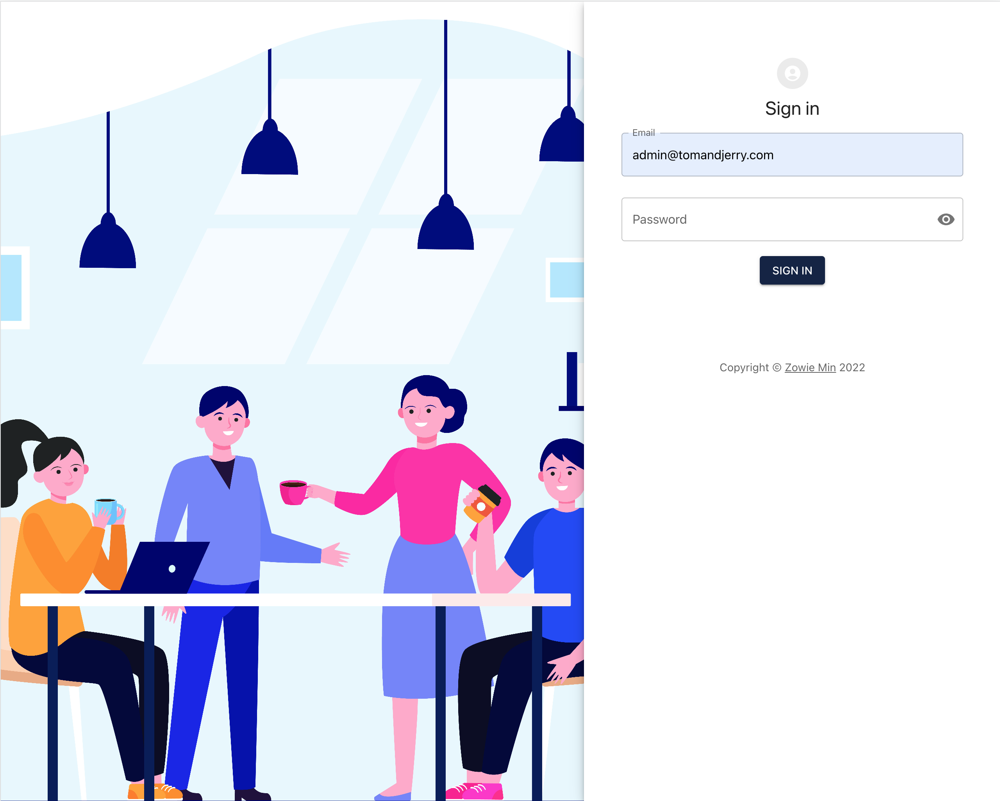
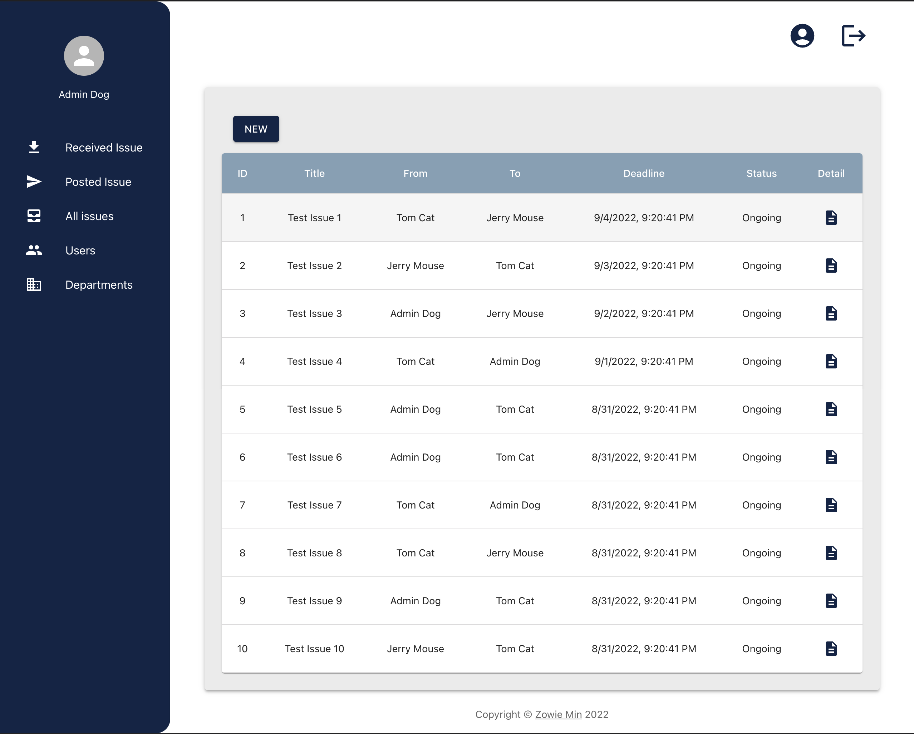
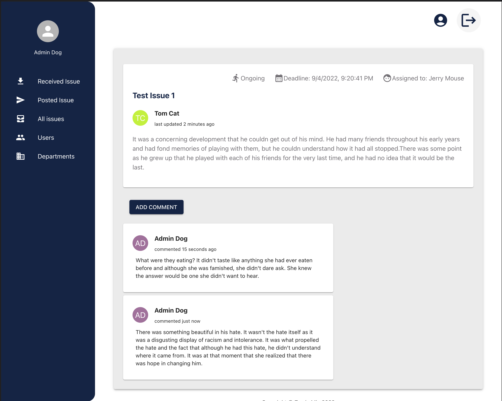
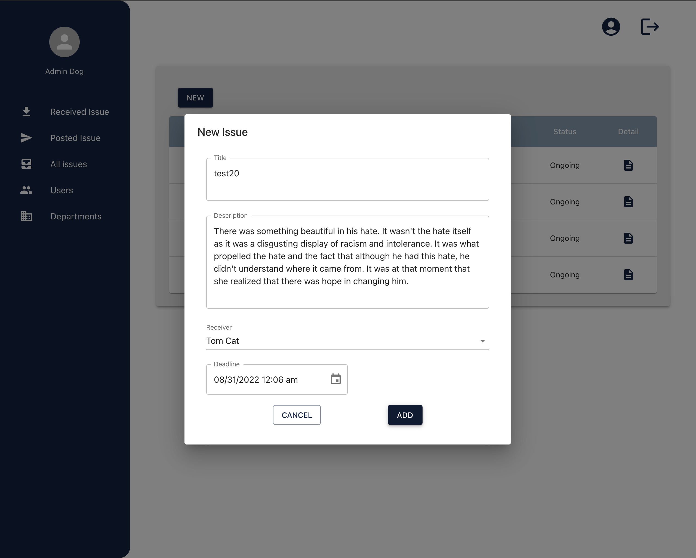
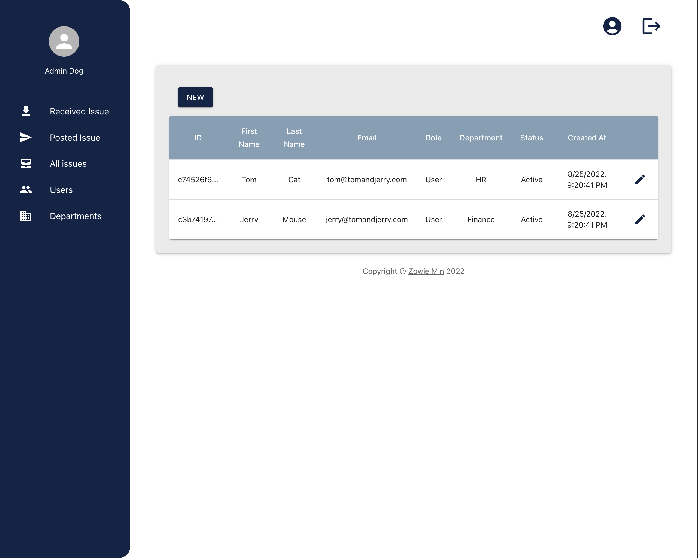

# Issue Tracker Frontend

An issue tracker app that employees within a company can post and receive issues from each other.
Admin account can add department, add user and update user's settings.
This repo is paired with [Issue Tracker API](https://github.com/Zowie0122/issue_tracker-api).







## Main Features

- This API contains two types of permissions, `admin` and `user` within each company.
- User is able to read, post, update issues and post comments to issues.
- User is able to update his/her own profile, like name and password.
- Admin has all the features that a user has, plus extra permission to add a department, add a new user and reset user information like password, department, and permission.
- A user or admin can only access the information that belongs to his/her company.

## Main Technologies

- TypeScript
- React.js (Hooks)
- React Hook Form
- Redux (RTK query)
- React Router V6
- MUI
- Docker

## How to start

1. This project requires this [repo](https://github.com/Zowie0122/issue_tracker_api) which is the API, please follow the [instruction](https://github.com/Zowie0122/issue_tracker_api/blob/main/README.md) to start the backend server first.

2. Copy the environment variable to `.env` from `.env.example` by

```
cat .env.example >> .env
```

3. Please install [Docker](https://www.docker.com/products/docker-desktop/) if you hasn't, don't worry, it is still free 😆 !

4. Make sure your Docker is up and running and host machine and docker environment are all available for port: `3000`. Then run

```
make restart
```

5. Go to `http://localhost:3000/login`, log in as user

```
email: tom@tomandjerry.com
password: pAssword1@
```

Or as admin

```
email: admin@tomandjerry.com
password: pAssword1@
```

6. To stop the container, run

```
make down
```

For more come in handy commands, please refer to [Makefile](./Makefile)

✨✨✨✨✨✨Welcome any ideas to make this project better! Happy Coding 👩🏻‍💻✨✨✨✨✨✨
